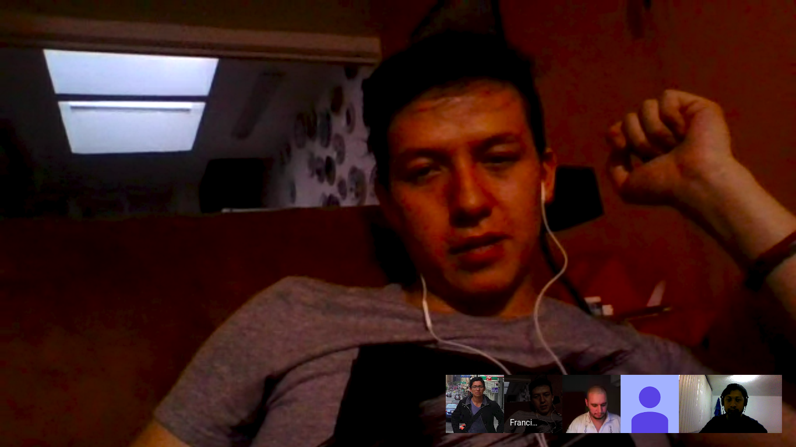

# #60DaysOfUdacity

This is one of the initiatives of the course, it consist on doing something related to the course at least 30 minutes during 60 days.

## Day 1

First template on [Study Tips](Study%20Tips.md) and general plan for the 60 days of code challenge.

## Day 2

Engage in the slack comunity and divide Section 1 in lessons for this notes (still work to be done there - changed to a Lesson-Proyect-Code basis).

## Day 3

Worked on the notes around parallel databases and evaluating the differencial privacy of a query.

## Day 4

Reagange section 1 in a Lesson-Proyect-Code basis also read some articles and videos around privacy.

## Day 5

Read about permissions in browser extensions and which data they have access to. Join study groups and learn about other initiatives like the [Papers Discussion Club](https://github.com/papersdclub/theclub).

## Day 6

Today I read of a couple of papers: [ML Confidential: Machine Learning on Encrypted Data](https://eprint.iacr.org/2012/323.pdf) and [Differentially Private Federated Learning: A Client Level Perspective](https://arxiv.org/pdf/1712.07557.pdf).

## Day 7

I have continued reading some of the the papers that are suggested in several channels over here. I also try to get to know when the meeting will take place for #sg_mexico created a little pool to help the process going.

## Day 8

I was part of the #sg_mexico meetting. I felt I was behind with the course but thanks to it I realize I am still on track.

## Day 9

Starting to read the [Algorithmic Foundations of Differential Privacy](https://www.cis.upenn.edu/~aaroth/Papers/privacybook.pdf) book. Hope this clarifies some doubts and go deeper in the concepts.

## Day 10

I watched this video in spanish. It talks about the usage of leaked data and some ways to make profiles out of it.

*Big Data & AI for Bad Guys*

## Day 11

I know this video is not completely related but still makes sense to me since privacy it's not a needed without data science.

*Thinking Like a Data Scientist*

## Day 12

Participated in AMA sessions and come back to slack community. After two week break.

## Day 13

Watched The Great Hack, a documentary about Cambidge Analytica Story. It talks about privacy and the lack of democracy that technology allows.

## Day 14

Reviewed topics on lesson 7 about federated learning. Participated in the weekly Kahoot quiz and wrote some reflections about privacy.

## Day 15

Working on the script of the podcast episode around privacy. I will discuss about differential privacy and some discussions talked in this community around privacy.

Its mid-related but I have also been reviewing some topics about probability. It includes things like Markov chains so I guess it has something to do with the topic.

## Day 16

I watched the The LinkedIn Guide to Getting Interviews without Applying. Part 1: Profile Optimization https://youtu.be/vMFxH5zH1Fo Not necessarily part of the course but part of Udacity.

## Day 17

Participated in the weekly Kahoot quiz and wrote some reflections about privacy.
Updated my notes from section 1 to be more simple and self explanatory in lesson 1, 2 and 3.

## Day 18

Participated in the weekly Kahoot quiz and wrote some reflections about privacy.
Working on simplifying notes on differencial privacy adding local noise.

## Todo list

- Finish lesson notes and proyects
- Finish [Algorithmic Foundations of Differential Privacy](https://www.cis.upenn.edu/~aaroth/Papers/privacybook.pdf)
- [Deep Learning with Differential Privacy](https://arxiv.org/pdf/1607.00133.pdf)
- Participate in a kaggle competition or make a kaggle kernel
