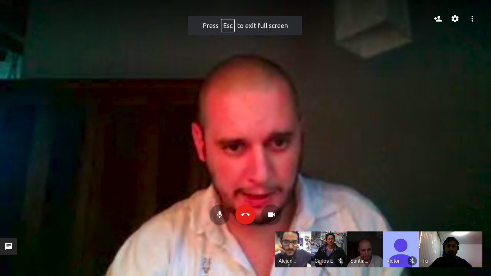

# #60DaysOfUdacity

This is one of the initiatives of the course, it consist on doing something related to the course at least 30 minutes during 60 days.

### What did I learned from this challenge

This challenge was really hard to complete and follow becuase of personal and familiar problems. I pushed myself to continue on it until a point that makes sense but to be honest I didn't fully enjoyed some parts of it. 

I discovered that I don't really like daily challenges. It demotivates me instead of helping me. It stops creativity for me, because it feels like you can only do a really small subset of things instead of going all-in. Also I work better with massive marathons and long breaks. This means I can get completly obssed with certain topic for a week or two and then leave it resting for a while. I can't really do 30 min each day. When I want to go deeper, it feels restrictive and when I don't want to do anything, it feels impositive.

Practice is always king. I rushed into watching the videos at the begging and complete the course really quick but later on discovered several holes in my understanding because of it. The challenge helped me to go back on some things that without a plan I will never revisit and therefore not getting the whole idea.

Privacy is important but not my topic. Unfortunatelly it was not a topic that I loved. It was interesting to learn but not to keep. Since the course started I have been programming almost dialy but in unrelated things. So I discovered myself in my long-term interests and realize privacy is not one of them.

## Day 1

First template on [Study Tips](Study%20Tips.md) and general plan for the 60 days of code challenge.

## Day 2

Engage in the slack comunity and divide Section 1 in lessons for this notes (still work to be done there - changed to a Lesson-Proyect-Code basis).

## Day 3

Worked on the notes around parallel databases and evaluating the differencial privacy of a query.

## Day 4

Reagange section 1 in a Lesson-Proyect-Code basis also read some articles and videos around privacy.

## Day 5

Read about permissions in browser extensions and which data they have access to. Join study groups and learn about other initiatives like the [Papers Discussion Club](https://github.com/papersdclub/theclub).

## Day 6

Today I read of a couple of papers: [ML Confidential: Machine Learning on Encrypted Data](https://eprint.iacr.org/2012/323.pdf) and [Differentially Private Federated Learning: A Client Level Perspective](https://arxiv.org/pdf/1712.07557.pdf).

## Day 7

I have continued reading some of the the papers that are suggested in several channels over here. I also try to get to know when the meeting will take place for #sg_mexico created a little pool to help the process going.

## Day 8

I was part of the #sg_mexico meetting. I felt I was behind with the course but thanks to it I realize I am still on track.

## Day 9

Starting to read the [Algorithmic Foundations of Differential Privacy](https://www.cis.upenn.edu/~aaroth/Papers/privacybook.pdf) book. Hope this clarifies some doubts and go deeper in the concepts.

## Day 10

I watched this video in spanish. It talks about the usage of leaked data and some ways to make profiles out of it.

*Big Data & AI for Bad Guys*

## Day 11

I know this video is not completely related but still makes sense to me since privacy it's not a needed without data science.

*Thinking Like a Data Scientist*

## Day 12

Participated in AMA sessions and come back to slack community. After two week break.

## Day 13

Watched The Great Hack, a documentary about Cambidge Analytica Story. It talks about privacy and the lack of democracy that technology allows.

## Day 14

Reviewed topics on lesson 7 about federated learning. Participated in the weekly Kahoot quiz and wrote some reflections about privacy.

## Day 15

Working on the script of the podcast episode around privacy. I will discuss about differential privacy and some discussions talked in this community around privacy.

Its mid-related but I have also been reviewing some topics about probability. It includes things like Markov chains so I guess it has something to do with the topic.

## Day 16

I watched the The LinkedIn Guide to Getting Interviews without Applying. Part 1: Profile Optimization https://youtu.be/vMFxH5zH1Fo Not necessarily part of the course but part of Udacity.

## Day 17

Participated in the weekly Kahoot quiz and wrote some reflections about privacy.
Updated my notes from section 1 to be more simple and self explanatory in lesson 1, 2 and 3.

## Day 18

Participated in the weekly Kahoot quiz and wrote some reflections about privacy.
Working on simplifying notes on differencial privacy adding local noise.

## Day 19

Worked on global differential privacy, epsilon-delta definition and laplacian noise on the notes (lesson 3,4,5 of section 1) .

## Day 20

Finished with Laplace noise and delta-epsilon definition. Working on PATE analysis and differential privacy for deep learning. 

## Day 21

I get now what PATE is used for, it was a blank in the course for me. I needed to see again the videos and make again the project and play around but finally is done.

## Day 22

Participated in Resume Review dynamic. On #jobs channel in the slack community. 

## Day 23

Worked on notes on section 2, federated learning. 
Made a plan on how to finish this course and challenge.

## Day 24 (pending)

Finished notes on section 2.

## Day 25 (pending)

Worked on notes on section 3

## Day 26 (pending)

Finished noted on section 3 and start notes on section 4.

## Day 27 (pending)

Finished notes on Section 4.

## Day 28 (pending)

Write script of episode describing the topics related to the course.

## Day 29 (pending)

Record podcast episode about differential privacy and federated learning.

## Day 30 (pending)

Finish to edit and upload episode about privacy.

## Day 31-60 (pending)

For the next 30 days I will work in kaggle. Becuase its a different proyect and comunity I believe I will make it in a separate repository.